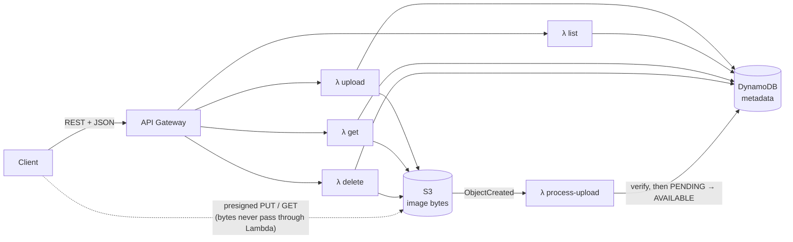

# Image Service

The service layer for image upload and storage in an Instagram-style app. Users upload images with metadata, list and filter them, view or download them, and delete their own. It is built on **API Gateway + AWS Lambda + S3 + DynamoDB** and runs fully locally on **LocalStack**.

| | |
|---|---|
| **Language** | Python 3.8+ (Lambda runtime: `python3.11`) |
| **Runtime dependencies** | None. `boto3` ships with the Lambda runtime |
| **Tests** | 119 unit tests with 99% coverage, plus 3 end-to-end tests against LocalStack |
| **Docs** | This README and [`docs/openapi.yaml`](docs/openapi.yaml) (OpenAPI 3) |

---

## Quick start

**Prerequisites:** Docker, Python 3.8+, `make`.

```bash
make install   # virtualenv + dev dependencies
make up        # start LocalStack (docker compose)
make deploy    # create S3 bucket, DynamoDB table, 5 Lambdas, API Gateway
make demo      # exercise every endpoint end-to-end
make test      # unit tests (no Docker needed)
```

`make all` runs install → up → deploy → demo in one go. `make deploy` prints the API base URL and saves it to `.api_url`:

```bash
API=$(cat .api_url)/images
```

> **LocalStack version.** `docker-compose.yml` pins `localstack/localstack:4.4.0`, a community release that needs no account. Images published since March 2026 require a free auth token. To use the latest instead: `LOCALSTACK_IMAGE=localstack/localstack:latest LOCALSTACK_AUTH_TOKEN=<token> make up`.

---

## Architecture



- **One Lambda per route.** Each function scales, is monitored, and could be permissioned independently. All five share one small code package (about 18 KB) built from `src/image_service`.
- **Layered code.** Thin handlers (HTTP/event parsing) → `ImageService` (business rules) → `ImageRepository` (DynamoDB) and `ImageStorage` (S3). The service layer knows nothing about Lambda events, so it is easy to test and reuse.

### Upload flow

Uploads support two modes because API Gateway caps payloads at 10 MB and Lambda at 6 MB:

1. **Inline (≤ 4 MB).** The client sends base64 bytes in the JSON body. The Lambda stores the object in S3, then writes the metadata, and returns `201 AVAILABLE`. It is simplest for small images and for demos.
2. **Presigned (≤ 20 MB, configurable).** The client sends only the metadata. The service writes a `PENDING` record and returns a presigned S3 `PUT` URL (`202`). The client uploads **directly to S3**, so large files never touch Lambda. S3's `ObjectCreated` event triggers `process-upload`, which:
   - checks the real size and reads the first 16 bytes to verify the **magic number** matches the declared type (a `.png` that is really a shell script is rejected);
   - marks the record `AVAILABLE`, or deletes the object and marks it `REJECTED`.

The status update is conditional on `status = PENDING`, so S3's at-least-once event delivery is harmless. A redelivered event is a no-op.

---

## API reference

Base URL: the value in `.api_url`. The full schema is in [`docs/openapi.yaml`](docs/openapi.yaml), which you can paste into [editor.swagger.io](https://editor.swagger.io) to browse it.

| Method | Path | Purpose | Auth |
|---|---|---|---|
| `POST` | `/images` | Upload an image with metadata | `X-User-Id` |
| `GET` | `/images` | List images with filters and pagination | none |
| `GET` | `/images/{image_id}` | Metadata plus presigned view/download URLs | none |
| `GET` | `/images/{image_id}?download=true` | 302 redirect to the file | none |
| `DELETE` | `/images/{image_id}` | Delete an image (owner only) | `X-User-Id` |

**Identity:** `X-User-Id` stands in for real authentication locally. In production, API Gateway would use a Cognito authorizer and the service already reads the verified `sub` claim first (`http.caller_id`). This means clients cannot spoof it once an authorizer is attached.

### Upload: inline

```bash
curl -s -X POST "$API" -H "X-User-Id: alice" -H "Content-Type: application/json" -d "{
  \"image_base64\": \"$(base64 < photo.png | tr -d '\n')\",
  \"title\": \"Sunset\", \"description\": \"Golden hour\",
  \"tags\": [\"travel\", \"beach\"], \"file_name\": \"photo.png\"
}"
```

```json
{
  "image": {
    "image_id": "3f2a9c1e5b7d4e8fa1c2d3e4f5a6b7c8",
    "user_id": "alice", "title": "Sunset", "description": "Golden hour",
    "tags": ["travel", "beach"], "content_type": "image/png", "file_name": "photo.png",
    "size_bytes": 48213, "status": "AVAILABLE",
    "created_at": "2026-09-29T10:15:30.123456Z", "updated_at": "2026-09-29T10:15:30.123456Z"
  }
}
```

`content_type` is optional here because it is detected from the file.

### Upload: presigned (large files)

```bash
RESP=$(curl -s -X POST "$API" -H "X-User-Id: alice" -H "Content-Type: application/json" \
  -d '{"content_type": "image/jpeg", "title": "Mountains", "tags": ["travel"]}')
# → 202 {"image": {..., "status": "PENDING"},
#        "upload": {"method": "PUT", "url": "http://localhost:4566/...", "headers": {"Content-Type": "image/jpeg"},
#                   "expires_in": 900, "max_bytes": 20971520}}

curl -X PUT "$(echo "$RESP" | jq -r .upload.url)" -H "Content-Type: image/jpeg" --data-binary @big.jpg
# seconds later, GET /images/{id} shows "status": "AVAILABLE"
```

### List and filter

| Query param | Meaning |
|---|---|
| `user_id` | Images by one user, **newest first** (DynamoDB GSI query) |
| `tag` | Images carrying a tag (case-insensitive) |
| `content_type` | `image/jpeg`, `image/png`, `image/gif`, `image/webp` |
| `created_from`, `created_to` | Inclusive date range. Accepts `2026-09-01` or full ISO-8601; a plain `created_to` date includes that whole day |
| `limit` | 1–100, default 20 |
| `next_token` | Opaque cursor from the previous page |

Filters combine with AND:

```bash
curl -s "$API?user_id=alice&tag=travel&created_from=2026-09-01&limit=10"
```

```json
{ "items": [ { "image_id": "...", "title": "Sunset", "...": "..." } ], "count": 10, "next_token": "eyJjcmVhdGVk..." }
```

Fetch the next page with `curl -s "$API?user_id=alice&tag=travel&created_from=2026-09-01&limit=10&next_token=eyJjcmVhdGVk..."`. `next_token` is `null` on the last page. A token only works with the same filters it came from.

### View / download

```bash
curl -s "$API/$IMAGE_ID"
# → metadata + "view_url" (inline) + "download_url" (attachment), both valid for 15 minutes

curl -L -o photo.png "$API/$IMAGE_ID?download=true"   # 302 → presigned S3 URL
```

Pending uploads return `view_url: null`, and `?download=true` returns `409` until the upload is verified.

### Delete

```bash
curl -i -X DELETE "$API/$IMAGE_ID" -H "X-User-Id: alice"   # 204; another user gets 403
```

### Errors

Every error has the same shape and a stable `code`:

```json
{ "error": { "code": "VALIDATION_ERROR", "message": "content_type must be one of: ...",
             "details": { "field": "content_type" }, "request_id": "5c1f..." } }
```

| Status | Code | When |
|---|---|---|
| 400 | `VALIDATION_ERROR` | Bad JSON, unsupported type, content doesn't match type, bad filters or token |
| 401 | `UNAUTHORIZED` | Missing or malformed caller identity |
| 403 | `FORBIDDEN` | Deleting someone else's image |
| 404 | `NOT_FOUND` | Unknown, deleted, or rejected image |
| 409 | `CONFLICT` | Downloading an image whose upload is still pending |
| 413 | `PAYLOAD_TOO_LARGE` | Inline upload over 4 MB (use presigned mode) |
| 500 | `INTERNAL_ERROR` | Unexpected. Details are logged, never returned |

---

## Data model

**S3 key:** `images/{user_id}/{image_id}.{ext}`. The bucket is private with public access blocked, SSE-encrypted, and has CORS enabled for browser uploads. Objects are only ever reached through short-lived presigned URLs.

**DynamoDB table** (on-demand capacity):

| Attribute | Notes |
|---|---|
| `image_id` (PK) | 32-char UUID4 hex |
| `user_id`, `created_at` | GSI `user_id-created_at-index` (HASH, RANGE) |
| `title`, `description`, `tags`, `file_name`, `content_type`, `size_bytes` | Metadata |
| `status` | `PENDING` → `AVAILABLE` or `REJECTED` |
| `s3_key`, `updated_at`, `rejection_reason` | Internal (never returned by the API) |

`created_at` is a fixed-width UTC string (`2026-09-29T10:15:30.123456Z`), so lexicographic order equals time order and it works directly as a sort key.

| Access pattern | How |
|---|---|
| Get / delete by id | `GetItem` / `DeleteItem` on the primary key |
| A user's images, newest first, optional date range | `Query` on the GSI, with the date range in the **key condition** |
| Tag / content type | `FilterExpression` on top of the query |
| Browse everything | Paginated `Scan` (see trade-offs) |

---

## Design decisions & trade-offs

- **Presigned uploads instead of streaming bytes through Lambda.** This removes the 6/10 MB payload ceilings, avoids paying Lambda time to shuffle bytes, and lets S3 absorb upload bandwidth, which is the main scalability lever for this workload. Inline mode is kept for small files because it is a single request.
- **Never trust the client.** Types are detected from magic bytes, sizes are checked after upload, tags are normalised, IDs are validated before they touch S3 keys, and download filenames are sanitised before going into `Content-Disposition` headers.
- **Race-free ownership check.** Delete is a single conditional `DeleteItem` (`user_id = :caller`), not read-then-delete, so there is no window between checking and deleting.
- **Ordering of writes for consistency without transactions** (S3 and DynamoDB cannot share one):
  - *Upload:* bytes first, then metadata; if metadata fails, the object is removed. The worst case is an orphaned object, never metadata pointing at nothing.
  - *Delete:* metadata first, then bytes. Once metadata is gone the image is invisible to every API, and a failed S3 delete only leaves a harmless orphan (an S3 lifecycle rule or sweeper would collect these in production).
- **Idempotent event processing.** State transitions are conditional on `PENDING`, so duplicate or late S3 events cannot corrupt state.
- **Pagination that never skips items.** Filter expressions can make DynamoDB pages sparse or empty. The repository keeps reading (bounded to 10 reads per request so one call can't walk the whole table) and builds the cursor from the *last returned item*, not DynamoDB's page boundary. This is tested explicitly.
- **Global listing uses a Scan.** Without `user_id` there is no natural partition key, and a single-value GSI partition would become a hot key. For a browse/admin endpoint a paginated, bounded scan is acceptable. At Instagram scale, "explore" would be served by a purpose-built feed (for example a write-sharded GSI, or DynamoDB Streams → OpenSearch).
- **Tag filter is a `FilterExpression`.** Simple and correct, but it reads items it then discards. At scale, tag lookups would move to an inverted index (one `TAG#<tag>` item per image/tag in a GSI) or OpenSearch.
- **Zero runtime dependencies.** Validation is hand-written rather than using Pydantic, so the deploy package is about 18 KB, cold starts stay fast, and there are no native wheels to build for the Lambda architecture.
- **Warm-start reuse.** boto3 clients are created once per container with adaptive retries, and logs are structured JSON (queryable in CloudWatch Logs Insights).

## Scalability

Every tier scales horizontally without capacity planning. API Gateway and Lambda scale per request, DynamoDB runs on on-demand capacity with high-cardinality partition keys (`image_id`; `user_id` on the GSI), and S3 handles the byte traffic directly via presigned URLs. Lambdas are stateless. The main levers left for production are listed below.

## Production hardening (what I'd do next)

- **Auth:** Cognito user-pool authorizer on API Gateway, dropping the `X-User-Id` stand-in.
- **Infrastructure as code:** move `scripts/deploy.py` to AWS SAM / CDK / Terraform, with per-stage configuration.
- **Image pipeline:** S3 event → SQS → Lambda for thumbnails and resized variants, plus malware scanning. Queueing smooths bursts and gives retries with a DLQ.
- **Delivery:** CloudFront in front of S3 with signed URLs/cookies (caching and edge delivery).
- **Consistency:** lifecycle rule to expire abandoned `PENDING` uploads and orphaned objects; DynamoDB TTL on stale `PENDING` records.
- **Protection:** API Gateway throttling and usage plans, WAF, per-user upload quotas.
- **Observability:** X-Ray tracing, CloudWatch metrics and alarms (error rate, p99 latency, rejected uploads).
- **Search:** tag/text search through DynamoDB Streams → OpenSearch.

---

## Testing

```bash
make test               # 119 unit tests, AWS mocked with moto (no Docker)
make coverage           # with a coverage report (99%)
make test-integration   # end-to-end against the LocalStack deployment
```

| File | Covers |
|---|---|
| `tests/test_models.py` | Validation: every field rule, magic-byte detection, size limits, date parsing, filter parsing |
| `tests/test_api.py` | Every endpoint through the real Lambda handlers against moto S3 and DynamoDB: happy paths, 400/401/403/404/409/413/500, each filter and combinations, pagination (including sparse pages), presigned upload confirmation, rejection of wrong-type, oversized and empty files, idempotent events, failure compensation |
| `tests/test_repository.py` | DynamoDB edge cases: no overwrites, conditional state transitions, ownership-conditional delete, read budget |
| `tests/test_config.py` | Configuration, filename sanitising, log format |
| `tests/integration/` | Real API Gateway → Lambda → S3/DynamoDB on LocalStack, including the S3 trigger |

The tests create the DynamoDB table from the same `schema.py` the deploy script uses, so tests and infrastructure cannot drift apart.

## Project layout

```
src/image_service/
  handlers.py        Lambda entry points (4 API routes + S3 trigger)
  http.py            API Gateway event parsing, responses, error handling, identity
  service.py         Business logic (upload modes, verification, ownership)
  repository.py      DynamoDB access, filters, pagination
  storage.py         S3 access, presigned URLs
  models.py          Domain model + request validation
  schema.py          DynamoDB table definition (shared by deploy + tests)
  config.py          Environment-driven settings
  errors.py          Error types → HTTP status codes
  logging_config.py  Structured JSON logs
scripts/
  deploy.py          Idempotent LocalStack deployment
  demo.py            End-to-end walkthrough of every endpoint
tests/               Unit + integration tests
docs/openapi.yaml    API specification
docker-compose.yml   LocalStack
```

## Configuration

Set on the Lambdas by `deploy.py`; defaults shown.

| Variable | Default | Purpose |
|---|---|---|
| `TABLE_NAME` / `BUCKET_NAME` | set by deploy | Resources |
| `PUBLIC_S3_ENDPOINT` | `http://localhost:4566` locally, unset on AWS | Host used in presigned URLs (must be reachable by clients, not just by the Lambda) |
| `MAX_UPLOAD_BYTES` | 20 MB | Presigned upload limit |
| `MAX_INLINE_UPLOAD_BYTES` | 4 MB | Inline upload limit |
| `URL_TTL_SECONDS` | 900 | Presigned URL lifetime |
| `DEFAULT_PAGE_SIZE` / `MAX_PAGE_SIZE` | 20 / 100 | Pagination |

## Troubleshooting

- **Lambdas fail to start:** LocalStack runs each function in its own container, so it needs `/var/run/docker.sock` (already mounted in `docker-compose.yml`). The first call to each function can take a few seconds while the runtime image is pulled. Use `make logs` to watch.
- **LocalStack exits asking for an auth token:** you are on a post-March-2026 image. Use the pinned default or set `LOCALSTACK_AUTH_TOKEN`.
- **Redeploying** is safe: `make deploy` is idempotent (it updates functions and recreates the API).
